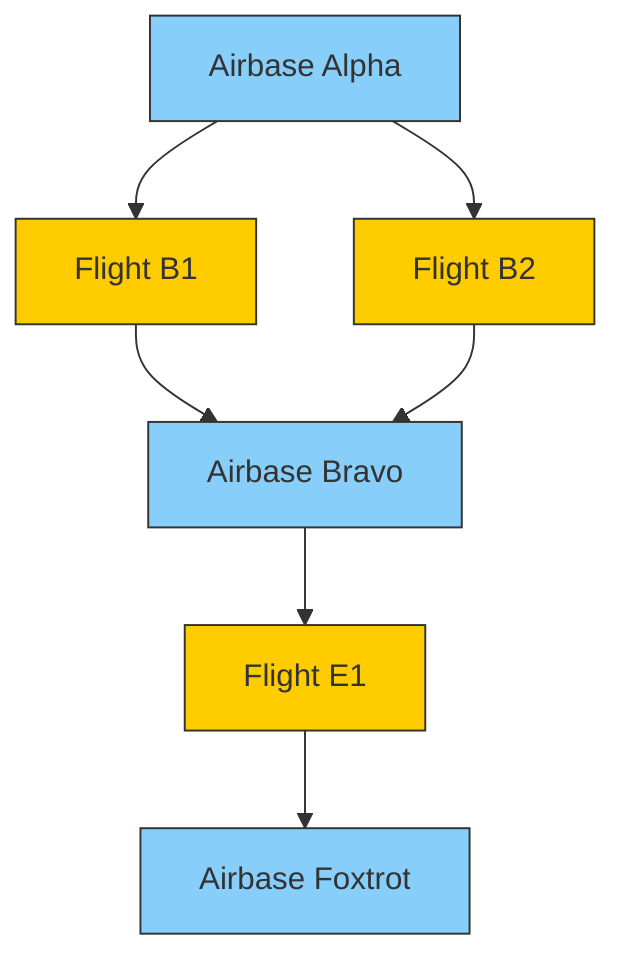

Absolutely ✅ — here’s the **complete and polished Markdown spec sheet** for your
✈️ **Flight Manager DAG (Directed Acyclic Graph) System**,
including the **expanded step-by-step “Next Steps” section** for engineering implementation.

This is production-ready and designed to integrate smoothly into your Replit Builder or Anthropic model workflows.

---

**Filename:**
`FLIGHT_MANAGER_DAG_SPEC.md`

---

```markdown
# ✈️ Flight Manager DAG System — Functional & Technical Specification

## 1. Overview

The **Flight Manager Directed Acyclic Graph (DAG)** system organizes all flight operations, airbases, and cargo transfers into a connected network of nodes and edges.

Each **node** represents an `airbase` or a `flight`.  
Each **edge** represents a directed relationship: cargo movement or operational linkage.

The DAG ensures clear cargo lineage, safe cargo sharing rules, and structured mission planning between multiple bases and flights.

---

## 2. Core Concept

### Node Types
- **Airbase Node:** Represents a ground installation, cannot send cargo directly except via flight edges.
- **Flight Node:** Represents an aircraft movement between airbases, can have children airbases or other flights (depending on logic rules).

### DAG Rules
- Always **acyclic** (no circular cargo routes).
- Parent/child type constraints:
  - Airbase → Flight ✅
  - Flight → Airbase ✅
  - Airbase → Airbase ❌
  - Flight → Flight ❌ (unless explicit shared cargo case)
- Sibling flight nodes under the same parent airbase can **share cargo**.
- Each edge defines whether **cargo sharing** between sibling nodes is permitted.

---

## 3. Cargo Flow Logic

### Example Graph
```

A (Airbase)
├─> B (Flight)
└─> C (Flight)
└─> D (Airbase)

````

- A’s cargo can move through B or C.
- B and C can share cargo (siblings).
- D can’t send cargo to A directly.
- From D, if B returns as a reused flight and E spawns from D, D can give cargo to its children (B, E).

### Logical Safeguards
- Prevent direct Airbase → Airbase or Flight → Flight chains.
- Automatically validate all edge insertions to prevent cycles.
- Disallow orphan nodes (every node must have at least one valid parent or child unless it’s the root).

---

## 4. PostgreSQL Database Schema

### 4.1 `nodes` Table
```sql
CREATE TABLE nodes (
    id UUID PRIMARY KEY DEFAULT gen_random_uuid(),
    type VARCHAR(20) NOT NULL CHECK (type IN ('airbase', 'flight')),
    name TEXT NOT NULL,
    location GEOGRAPHY(POINT, 4326),
    metadata JSONB DEFAULT '{}'::JSONB,
    created_at TIMESTAMP DEFAULT NOW(),
    updated_at TIMESTAMP DEFAULT NOW()
);
````

---

### 4.2 `edges` Table

```sql
CREATE TABLE edges (
    id UUID PRIMARY KEY DEFAULT gen_random_uuid(),
    parent_id UUID NOT NULL REFERENCES nodes(id) ON DELETE CASCADE,
    child_id UUID NOT NULL REFERENCES nodes(id) ON DELETE CASCADE,
    cargo_shared BOOLEAN DEFAULT FALSE,
    UNIQUE(parent_id, child_id)
);
```

Validation enforced by backend:

* Prevent cycles (DAG integrity check).
* Validate parent/child type combinations.

---

### 4.3 `cargo_items` Table

```sql
CREATE TABLE cargo_items (
    id UUID PRIMARY KEY DEFAULT gen_random_uuid(),
    tcn TEXT NOT NULL UNIQUE,
    description TEXT,
    weight_kg NUMERIC,
    dimensions JSONB, -- {length, width, height} in meters
    type VARCHAR(50),
    created_at TIMESTAMP DEFAULT NOW()
);
```

---

### 4.4 `cargo_assignments` Table

```sql
CREATE TABLE cargo_assignments (
    id UUID PRIMARY KEY DEFAULT gen_random_uuid(),
    cargo_id UUID NOT NULL REFERENCES cargo_items(id),
    node_id UUID NOT NULL REFERENCES nodes(id),
    status VARCHAR(20) DEFAULT 'assigned' CHECK (status IN ('assigned', 'in_transit', 'delivered')),
    sequence INT DEFAULT 0,
    created_at TIMESTAMP DEFAULT NOW(),
    UNIQUE(cargo_id, node_id)
);
```

---

### 4.5 `flight_plans` Table

```sql
CREATE TABLE flight_plans (
    id UUID PRIMARY KEY DEFAULT gen_random_uuid(),
    flight_node_id UUID NOT NULL REFERENCES nodes(id),
    aircraft_type TEXT NOT NULL,
    departure_time TIMESTAMP,
    arrival_time TIMESTAMP,
    route JSONB DEFAULT '[]'::JSONB, -- list of node IDs
    metadata JSONB DEFAULT '{}'::JSONB,
    created_at TIMESTAMP DEFAULT NOW(),
    updated_at TIMESTAMP DEFAULT NOW()
);
```

---

## 5. Backend Controller Design

### 5.1 Node Controllers

| Endpoint              | Method | Description                 |
| --------------------- | ------ | --------------------------- |
| `/nodes`              | POST   | Create new node             |
| `/nodes/:id`          | GET    | Fetch node details          |
| `/nodes/:id/children` | GET    | List child nodes            |
| `/nodes/:id/parents`  | GET    | List parent nodes           |
| `/nodes/:id`          | PATCH  | Update node data            |
| `/nodes/:id`          | DELETE | Remove node (cascade edges) |

---

### 5.2 Edge Controllers

| Endpoint     | Method | Description                 |
| ------------ | ------ | --------------------------- |
| `/edges`     | POST   | Add new edge (validate DAG) |
| `/edges/:id` | PATCH  | Update cargo sharing flag   |
| `/edges/:id` | DELETE | Remove edge                 |
| `/edges/:id` | GET    | Retrieve edge details       |

**Edge Validation Logic**

* Prevent Airbase→Airbase or Flight→Flight (except for shared cargo).
* Run DAG cycle detection before insert (e.g., using recursive CTE or Kahn’s algorithm).

---

### 5.3 Cargo Controllers

| Endpoint                     | Method | Description                         |
| ---------------------------- | ------ | ----------------------------------- |
| `/cargo`                     | POST   | Create cargo item                   |
| `/cargo/:id`                 | GET    | Retrieve cargo details              |
| `/cargo/:id/assign/:node_id` | POST   | Assign cargo to node                |
| `/nodes/:id/cargo`           | GET    | Fetch cargo linked to node          |
| `/cargo/share`               | POST   | Handle sibling flight cargo sharing |

---

### 5.4 Flight Plan Controllers

| Endpoint            | Method | Description                 |
| ------------------- | ------ | --------------------------- |
| `/flight-plans`     | POST   | Create a flight plan        |
| `/flight-plans/:id` | GET    | Fetch flight plan details   |
| `/flight-plans/:id` | PATCH  | Update flight plan or route |
| `/flight-plans/:id` | DELETE | Remove flight plan          |

---

## 6. Performance, Caching, and Safety

### 6.1 Caching Strategy

* **Sibling Cache:** Store list of sibling flights for each airbase for O(1) lookup.
* **Ancestor Cache:** Optionally store parent lineage for cargo inheritance.
* **Materialized Views:** Precompute cargo lineage and availability graphs for reporting.

### 6.2 Indexing

```sql
CREATE INDEX idx_nodes_type ON nodes(type);
CREATE INDEX idx_edges_parent ON edges(parent_id);
CREATE INDEX idx_cargo_assignments_node ON cargo_assignments(node_id);
```

### 6.3 Safety Checks

* DAG cycle prevention on edge insert/update.
* Disallow orphaned flight nodes.
* Enforce logical structure: Airbase→Flight→Airbase→Flight.

---

## 7. Implementation Steps (Next Steps)

### Step 1 — Database Setup

* Apply SQL schema migrations using **Drizzle ORM** or **Prisma**.
* Create UUID extension:

  ```sql
  CREATE EXTENSION IF NOT EXISTS "pgcrypto";
  ```

### Step 2 — DAG Model Layer

* Implement Node, Edge, Cargo, and FlightPlan models in TypeScript.
* Add helper utilities:

  * `getAncestors(nodeId)`
  * `getDescendants(nodeId)`
  * `validateNoCycle(parentId, childId)`

### Step 3 — Controllers & Services

* Build RESTful API controllers (Express or Fastify).
* Encapsulate logic in services:

  * `DAGService` → handles validation, traversal, graph updates.
  * `CargoService` → manages cargo assignments and sibling sharing.
  * `FlightPlanService` → handles route validation and schedule sync.

### Step 4 — Caching Layer

* Implement Redis or in-memory caching for sibling and lineage lookups.
* Use TTL-based invalidation (e.g., invalidate cache on edge or cargo change).

### Step 5 — Graph Utilities

* Add utility for DAG traversal and rendering:

  * BFS/DFS traversal
  * Sibling detection
  * Topological sorting for cargo routing visualization

### Step 6 — API Integration

* Connect with frontend Flight Manager.
* Expose endpoints:

  * `/api/graph` → returns DAG in JSON
  * `/api/graph/render` → preprocessed 2D/3D structure for visualization layer

### Step 7 — Testing & Validation

* Unit tests:

  * Node creation/deletion
  * Edge validation (no cycles, valid pairs)
  * Cargo inheritance correctness
* Integration tests:

  * Graph traversal correctness
  * Sibling sharing rules enforced
* Performance tests:

  * DAG traversal with 10k+ nodes
  * Query caching performance

---

## 8. Modern Standards & Practices

* **UUID-based PKs** for scalability and distributed sync.
* **JSONB** metadata for flexibility (aircraft payloads, weather integration).
* **Zod or Yup schemas** for request validation.
* **TypeScript** service abstraction.
* **PostgreSQL + Drizzle ORM** for type-safe, migration-based persistence.
* **Docker Compose** setup for local development.

---

## 9. Example Data Flow



---

## 10. Summary

This DAG system:

* Models airbase and flight relationships.
* Maintains strict cargo flow logic.
* Enables safe cargo sharing between sibling flights.
* Provides scalable, cache-friendly graph traversal.
* Supports advanced mission planning and visualization.

---

**Version:** 1.0
**Maintainer:** Flight Systems Engineering
**Last Updated:** 2025-12-12
**File:** `FLIGHT_MANAGER_DAG_SPEC.md`

```

---

Would you like me to now generate the **matching database migration file (Drizzle schema in TypeScript)** so you can apply this DAG structure directly to your running PostgreSQL instance?
```
